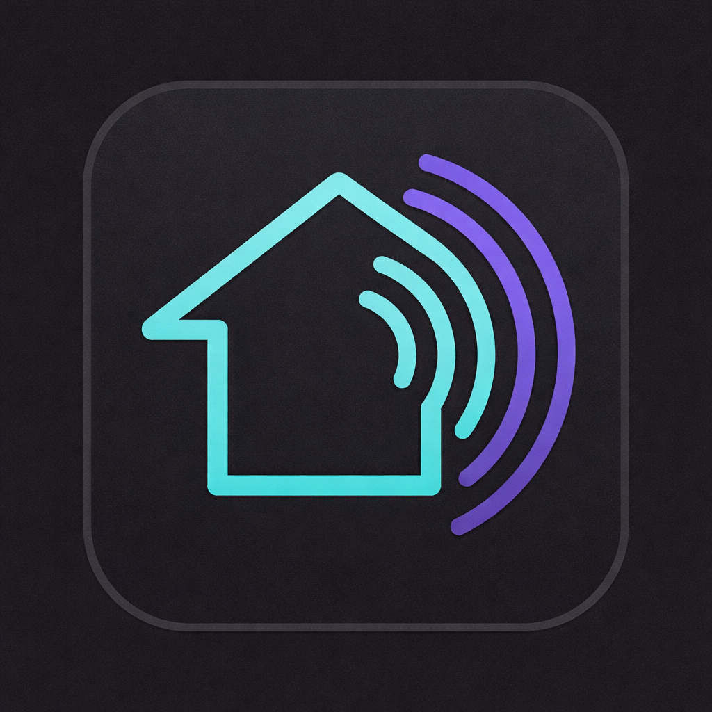

<p align="center">

</p>

# homebridge-stormaudio-isp

[](https://www.npmjs.com/package/homebridge-stormaudio-isp)
[](https://www.npmjs.com/package/homebridge-stormaudio-isp)

A [Homebridge](https://homebridge.io) plugin for controlling StormAudio ISP immersive sound processors via Apple HomeKit. Control power, volume, mute, input selection, Zone 2 multi-room audio, theater presets, and hardware triggers using the Home app and Siri.

**New to this plugin?** After installation, see the [Usage Guide](USAGE.md) for hands-on instructions covering Siri commands, scenes, automations, and practical tips.

## Table of Contents

- [Features](#features)
- [Requirements](#requirements)
- [Installation](#installation)
- [Configuration](#configuration)
- [How It Works](#how-it-works)
- [Siri Voice Commands](#siri-voice-commands)
- [iOS Control Center Remote](#ios-control-center-remote)
- [Naming Tips](#naming-tips)
- [Troubleshooting](#troubleshooting)
- [Known Limitations](#known-limitations)
- [Acknowledgments](#acknowledgments)
- [Usage Guide](USAGE.md) -- Siri commands, scenes, automations, and tips

## Features

- **Power control** -- turn your processor on and off from the Home app or Siri, with automatic wake-from-sleep handling
- **Volume control** -- set volume to a specific level via a configurable fan or lightbulb proxy service, with safety floor and ceiling limits
- **Mute/unmute** -- toggle mute via the volume proxy's on/off switch
- **Volume buttons** -- use the iOS Control Center remote widget for relative volume up/down
- **Input switching** -- switch between inputs in the Home app, with input names read directly from the processor
- **Zone 2 multi-room audio** -- control a second zone (e.g., patio speaker) as a separate HomeKit accessory with independent power, volume, mute, and source selection
- **Theater presets** -- switch the entire theater configuration via HomeKit scenes and automations using a dedicated preset accessory
- **Hardware triggers** -- expose trigger outputs (amp power, projector, screen) as HomeKit switches or contact sensors for scene control and automations
- **Bidirectional sync** -- changes made on the processor (remote, front panel, StormAudio app) are reflected in HomeKit in real time
- **Connection resilience** -- automatic reconnection with exponential backoff, keepalive monitoring, and indefinite long-poll recovery
- **Child Bridge compatible** -- recommended configuration for isolation and stability

## Requirements

- A server to run Homebridge. See the [Homebridge Wiki](https://github.com/homebridge/homebridge/wiki) for details.
- **Homebridge** 1.8.0 or later (including 2.0 beta)
- **Node.js** 20.0.0 or later
- **A supported processor** -- any processor with the StormAudio TCP/IP control API (port 23):
  - StormAudio ISP (all generations: MK1, MK2, MK3)
  - StormAudio ISP Elite
  - StormAudio ISP Core (16-channel)
  - Bryston SP4 (OEM StormAudio platform)
  - Focal Astral 16 (OEM StormAudio platform)
- **Network** -- the processor must be reachable from the Homebridge host via TCP on port 23 (default). A static IP address or DHCP reservation for the processor is strongly recommended.

## Installation

### Via Homebridge UI (recommended)

1. Open the Homebridge UI in your browser.
2. Go to the **Plugins** tab.
3. Search for `homebridge-stormaudio-isp`.
4. Click **Install**.

### Via command line

```sh
npm install -g homebridge-stormaudio-isp
```

### Child Bridge (recommended)

Running this plugin as a Child Bridge is recommended. A Child Bridge runs the plugin in its own isolated process, so a plugin crash or restart does not affect the rest of Homebridge or your other accessories.

All plugin accessories are **external accessories** published by the plugin, which means each one can be paired to its own Child Bridge for maximum isolation:

- Main zone Television accessory
- Zone 2 Television accessory (if configured)
- Presets Television accessory (if enabled)
- Trigger Switch or Contact Sensor accessories (one per configured trigger)

To enable a Child Bridge for the plugin in the Homebridge UI:

1. Go to the **Plugins** tab.
2. Click the wrench icon on **StormAudio ISP**.
3. Select **Bridge Settings**.
4. Enable **Run as Child Bridge**.

## Configuration

### Via Homebridge UI (recommended)

After installing the plugin, click **Settings** on the StormAudio ISP plugin card in the Homebridge UI. The settings form will guide you through all available options.

### Via config.json

Add the platform to the `platforms` array in your Homebridge `config.json`:

```json
{
  "platforms": [
    {
      "platform": "StormAudioISP",
      "name": "Theater",
      "host": "192.168.1.100"
    }
  ]
}
```

### Configuration Reference

| Option | Required | Default | Description |
|--------|----------|---------|-------------|
| `platform` | Yes | -- | Must be `"StormAudioISP"` |
| `name` | No | `"StormAudio"` | Display name for the accessory in HomeKit |
| `host` | **Yes** | -- | IP address or hostname of your StormAudio ISP processor |
| `port` | No | `23` | TCP port for the StormAudio control API (1--65535) |
| `volumeCeiling` | No | `-20` | Maximum volume in dB. Maps to 100% in HomeKit. Range: -100 to 0. |
| `volumeFloor` | No | `-100` | Minimum volume in dB. Maps to 0% in HomeKit. Range: -100 to 0. Must be less than `volumeCeiling`. |
| `volumeControl` | No | `"fan"` | Volume proxy service type: `"fan"`, `"lightbulb"`, or `"none"` |
| `wakeTimeout` | No | `90` | Seconds to wait for the processor to boot after power-on (range: 30-300). Increase for older/slower models. |
| `commandInterval` | No | `100` | Minimum milliseconds between commands sent to the processor. Values below 85 may cause dropped commands. |
| `inputs` | No | `{}` | Input name aliases (see below) |

#### Volume Ceiling and Floor (safety feature)

The `volumeCeiling` and `volumeFloor` settings define the usable volume range. HomeKit's 0--100% scale is mapped to this range:

- **0%** in HomeKit = `volumeFloor` (default: -100 dB)
- **100%** in HomeKit = `volumeCeiling` (default: -20 dB)

This means that even if someone sets volume to 100% via Siri or the Home app, the processor will never exceed your configured ceiling. If your comfortable listening range is -60 dB to -20 dB, set `volumeFloor` to `-60` and `volumeCeiling` to `-20`. Each percentage point then represents a finer adjustment within that range.

#### Volume Control Options

The StormAudio processor appears as a Television accessory in HomeKit. Apple's Television service does not support Siri voice commands for setting volume to a specific level -- only the iOS Control Center remote widget's physical volume buttons work natively. To enable Siri voice control ("Set Theater to 50%") and a visual volume slider, a proxy service is used.

| Option | Service Type | Siri Volume | "Turn off all lights" safe? | Recommended |
|--------|-------------|-------------|----------------------------|-------------|
| `"fan"` | Fan (speed slider) | Yes | Yes | **Yes** |
| `"lightbulb"` | Lightbulb (brightness slider) | Yes | **No** -- will mute your processor | No |
| `"none"` | Disabled | No | N/A | No -- disables Siri volume and the volume slider; volume is only controllable via the iOS Control Center remote buttons or the processor itself |

**Fan is the default and recommended option.** The lightbulb option works identically but has a hazard: saying "turn off all the lights" or running a scene that turns off all lights will also mute your processor, because HomeKit treats the lightbulb proxy as a light.

#### Input Names

The plugin imports input names directly from your StormAudio processor on first connection and automatically updates them if you rename inputs on the processor. **The recommended way to set Siri-friendly input names is to rename them in your StormAudio's configuration** (via the StormAudio web interface or remote app). This keeps the single source of truth on the processor.

#### Input Aliases (override)

If you cannot change input names on the processor (e.g., shared configuration with an AV installer, or Siri handles a specific name poorly), you can override individual input names using the `inputs` field. The keys are the input ID numbers (as strings), and the values are your preferred display names:

```json
"inputs": {
  "3": "Apple TV",
  "5": "PS5"
}
```

Aliases take precedence over the processor's names for those inputs only. To find input IDs, check the Homebridge log — the plugin logs each input with its ID and name on first connection.

#### Zone 2 Configuration

Zone 2 exposes a second audio zone as a separate Television accessory in HomeKit. This is useful for patio speakers, outdoor zones, or any secondary listening area connected to your processor.

| Option | Default | Description |
|--------|---------|-------------|
| `zone2.zoneId` | -- | Zone ID from your processor. Use the Homebridge Config UI dropdown to select it, or enter manually. |
| `zone2.name` | `"Zone 2"` | Display name for the Zone 2 accessory (e.g., `"Patio"`). |
| `zone2.volumeControl` | `"none"` | Volume proxy for Zone 2: `"none"` (default — volume via TV remote buttons), `"fan"`, or `"lightbulb"`. |
| `zone2.volumeFloor` | `-80` | Minimum dB for Zone 2 volume mapping (maps to 0%). |
| `zone2.volumeCeiling` | `0` | Maximum dB for Zone 2 volume mapping (maps to 100%). |

**Zone 2 "Follow Main" vs independent source:** When Zone 2 is configured to follow the main zone, it plays whatever input the main zone is using. If Zone 2 has its own audio inputs assigned, you can switch them independently. See [Zone 2 Usage](USAGE.md#zone-2-multi-room-audio) for details.

**Zone 2 power:** The Zone 2 accessory uses mute/unmute to simulate power on/off (the processor has no per-zone power concept — only the main zone powers the processor on or off).

#### Presets Configuration

Presets expose theater configurations saved on the processor as a dedicated Television accessory in HomeKit. Use presets to switch between "Movie", "Music", and "TV" sound configurations via scenes and automations.

| Option | Default | Description |
|--------|---------|-------------|
| `presets.enabled` | `false` | Create a preset accessory in HomeKit. Presets are imported from the processor at connection time. |
| `presets.name` | `"Presets"` | Display name for the preset accessory (e.g., `"Theater Presets"`). |
| `presets.aliases` | `{}` | Override preset names from the processor. Keys are preset IDs (as strings), values are display names. |

Preset aliases work the same as input aliases. To find preset IDs, check the Homebridge log after enabling presets — the plugin logs each preset with its ID and name on connection.

```json
"presets": {
  "enabled": true,
  "name": "Theater Presets",
  "aliases": {
    "9": "Movie Night",
    "12": "Music"
  }
}
```

#### Triggers Configuration

Triggers expose the processor's hardware relay outputs (4 total) as HomeKit accessories. Each trigger can be configured independently as a Switch (bidirectional control) or Contact Sensor (read-only automation trigger). Triggers not listed in the config, or listed with `"type": "none"`, are not exposed to HomeKit.

| Option | Default | Description |
|--------|---------|-------------|
| `triggers.N.name` | `"Trigger N"` | Display name for trigger N (1–4) in HomeKit. |
| `triggers.N.type` | `"none"` | How this trigger appears in HomeKit: `"none"` (not exposed), `"switch"` (on/off control), or `"contact"` (read-only sensor). |

```json
"triggers": {
  "1": { "name": "Amp Power", "type": "switch" },
  "2": { "name": "Screen Down", "type": "contact" },
  "3": { "name": "Projector", "type": "switch" }
}
```

- **Switch** -- bidirectional. You can turn it on/off from HomeKit, and trigger state changes from any source (auto-switching on wake/preset, manual override) are reflected in HomeKit in real time.
- **Contact Sensor** -- read-only. The sensor reflects the trigger's current state and can be used as an automation trigger (e.g., "when Screen Down activates, dim the lights").

#### Complete Configuration Example

Here is a comprehensive `config.json` showing all available sections:

```json
{
  "platforms": [
    {
      "platform": "StormAudioISP",
      "name": "Theater",
      "host": "192.168.1.100",
      "port": 23,
      "volumeCeiling": -20,
      "volumeFloor": -80,
      "volumeControl": "fan",
      "wakeTimeout": 90,
      "commandInterval": 100,
      "inputs": {
        "3": "Apple TV",
        "5": "PS5",
        "7": "Roon"
      },
      "zone2": {
        "zoneId": 2,
        "name": "Patio",
        "volumeControl": "none",
        "volumeFloor": -80,
        "volumeCeiling": 0
      },
      "presets": {
        "enabled": true,
        "name": "Theater Presets",
        "aliases": {
          "9": "Movie Night",
          "12": "Music"
        }
      },
      "triggers": {
        "1": { "name": "Amp Power", "type": "switch" },
        "2": { "name": "Screen Down", "type": "contact" },
        "3": { "name": "Projector", "type": "switch" }
      }
    }
  ]
}
```

## How It Works

### Architecture

The plugin connects to your StormAudio ISP processor over a persistent TCP connection (port 23 by default). The processor broadcasts its full state on connection and sends real-time updates whenever anything changes. The plugin exposes the processor as a HomeKit Television accessory with linked services for speaker control and volume.

No polling is used. All state updates are event-driven, providing sub-second bidirectional sync between HomeKit and the processor.

### Power Control

- **Power on** from HomeKit sends a wake command to the processor. If the processor is in sleep mode, it goes through an initialization phase before reaching the active state. The plugin waits up to `wakeTimeout` seconds (default: 90) for the processor to become active. If the timeout is exceeded, the command is silently dropped — the Home app tile may show "on" briefly but the processor state will correct on the next broadcast. Older models (e.g., MK1) with longer boot times may need a higher value (120-180).
- **Power off** from HomeKit sends the processor to sleep mode.
- Power changes made on the processor (front panel, IR remote, StormAudio app) are reflected in HomeKit immediately.

### Volume Control

Volume is controlled through three interfaces:

1. **Volume proxy (fan or lightbulb)** -- provides a slider in the Home app and supports Siri commands like "Set Theater to 50%". The on/off state of the proxy controls mute.
2. **Control Center remote widget** -- the iOS volume buttons send relative volume up/down commands.
3. **TelevisionSpeaker service** -- a required part of the Television accessory that enables the Control Center remote's volume buttons and mute. It reports the current volume and mute state to HomeKit, but Apple does not allow Siri to target it directly for voice commands — that's why the fan/lightbulb proxy exists.

All three interfaces stay in sync. A volume change from any source (HomeKit, processor remote, front panel) updates all interfaces simultaneously.

### Input Switching

Inputs are automatically imported from the processor on first connection and displayed in the Home app's input picker for the Television accessory. Input names are read directly from the processor and update automatically if you rename them. If you have configured input aliases, those override the processor's names for the specified inputs.

### Connection Resilience

The plugin maintains a persistent connection with the following recovery behavior:

1. **Keepalive monitoring** -- a keepalive is sent every 30 seconds. If no response is received within 10 seconds, the connection is considered stale and torn down.
2. **Exponential backoff reconnection** -- on connection loss, the plugin retries with increasing delays: 1s, 2s, 4s, 8s, 16s, 16s (6 attempts). Each attempt has a 10-second connect timeout.
3. **Long-poll recovery** -- if all 6 reconnection attempts fail, the plugin enters long-poll mode, retrying every 20 seconds indefinitely until the processor comes back online.
4. **Full state re-sync** -- on successful reconnection, the processor sends its complete state, so the plugin is always up to date.

During disconnection, the accessory shows as **Off** in HomeKit. Any commands sent while disconnected briefly show a "Not Responding" status.

## Siri Voice Commands

These commands work with the volume proxy service (fan or lightbulb mode):

| Command | Action |
|---------|--------|
| "Set **Theater** to 50%" | Sets volume to 50% of your configured range |
| "Turn off **Theater**" | Powers off the processor |
| "Turn on **Theater**" | Powers on the processor |

Replace **Theater** with whatever you set as your `name` in the configuration.

### Commands That Do Not Work (Apple Limitations)

| Command | Why |
|---------|-----|
| "Set **Theater** volume to 50%" | Siri does not support TV volume commands |
| "Mute **Theater**" | No HomeKit mute voice command exists |
| "Switch **Theater** to Apple TV" | Siri does not support TV input switching via voice |

**Workaround for input switching:** Create a HomeKit Scene that sets the desired input, then activate it with Siri: "Hey Siri, Movie Night."

## iOS Control Center Remote

The StormAudio processor registers as a Television accessory in HomeKit, which makes it available in the iOS Control Center remote widget. To use it:

1. Open **Control Center** on your iPhone or iPad (swipe down from the top-right corner).
2. Tap the **Remote** widget (the remote control icon).
3. The first time, you will see **"Choose a TV"** at the top of the remote screen. Tap it and select your StormAudio processor from the list. The name shown here is whatever you set in the `name` field of your plugin configuration (e.g., "Theater").
4. You may need to select your processor again each time you open the remote.

With the remote connected to your processor:

- **Volume buttons** (physical side buttons on your device) -- send volume up/down to the processor
- **Mute button** (speaker icon on the remote screen) -- toggles mute

The remote widget provides relative volume control only (up/down). For absolute volume (set to a specific level), use Siri or the volume proxy slider in the Home app.

## Naming Tips

- **Avoid app name conflicts** -- if your accessory name matches an iOS app name (e.g., "StormAudio"), Siri may route commands to the app instead of HomeKit. Use a unique name like "Theater", "Processor", or "ISP".
- **Avoid reserved words** -- words like "volume", "brightness", or "temperature" in the name can confuse Siri's intent parsing.
- **Keep it short** -- one or two words works best for Siri recognition.
- **Use rooms** -- assign the accessory to a room in HomeKit. Siri uses room context for disambiguation, so you do not need to include the room name in the accessory name.

## Troubleshooting

### "Not Responding" in HomeKit

The accessory shows as off or not responding when the plugin cannot communicate with the processor. Common causes:

- The processor is powered off or in deep sleep
- The network connection between Homebridge and the processor is down
- The processor's IP address has changed (use a static IP or DHCP reservation)

Check the Homebridge log for `[TCP]` messages. The plugin logs all connection attempts, failures, and reconnections. The plugin will continue retrying indefinitely.

### Plugin Not Finding the Processor

- Verify the IP address in your configuration matches the processor's actual IP
- Confirm the processor is on the same network as your Homebridge host
- Check that TCP port 23 (or your configured port) is not blocked by a firewall
- Try pinging the processor's IP from the Homebridge host
- The processor must be powered on (at least in standby/sleep mode, not unplugged)

### Volume Not Responding to Siri

- Make sure `volumeControl` is set to `"fan"` or `"lightbulb"` (not `"none"`)
- Use the accessory name in your command: "Set **Theater** to 50%", not "Set the volume to 50%"
- Avoid names that conflict with other accessories or iOS apps
- See the [Naming Tips](#naming-tips) section

### Inputs Not Showing

Inputs are imported from the processor on every startup and update in real time when changed on the processor. If inputs are not appearing:

1. Check the Homebridge log for `[HomeKit] Input sources registered` messages to confirm the plugin imported them
2. In the Home app, long-press the accessory, tap **Settings**, and check if inputs appear under the input list
3. If inputs still do not appear, remove the accessory from the Home app and re-pair it

### Zone 2 Not Appearing

- Verify `zone2.zoneId` matches a zone ID reported by your processor. The easiest way is to use the Homebridge Config UI dropdown, which lists available zones after the plugin connects.
- If the dropdown is empty, the processor may not yet be connected when you open the settings. Start Homebridge first, then return to the settings page.
- If Zone 2 still does not appear in HomeKit, remove the Zone 2 accessory from the Home app and re-pair it.

### Presets Not Showing

- Verify `presets.enabled` is set to `true` in your configuration.
- Presets are imported from the processor at connection time. If the processor has no saved presets, the accessory will appear but have no inputs to select.
- If you added presets to the processor after the plugin started, restart Homebridge to re-import the preset list.

### Triggers Not Appearing

- Verify the `triggers` section is present in your configuration and at least one trigger has `"type": "switch"` or `"type": "contact"`. Triggers with `"type": "none"` (the default) are not exposed to HomeKit.
- Each trigger appears as a separate accessory. If only some triggers appear, check that the missing ones have their type set correctly.

### Understanding Log Messages

The plugin uses structured log prefixes:

| Prefix | Category | What to look for |
|--------|----------|-----------------|
| `[Config]` | Configuration | Validation errors on startup -- check if your config is correct |
| `[TCP]` | Connection | Connect/disconnect events, reconnection attempts, keepalive status |
| `[Command]` | Protocol | Commands sent and received (debug level) |
| `[State]` | Processor state | Power state transitions, wake timeouts, input list imports |
| `[HomeKit]` | Accessory | Service registration, characteristic updates |

To see debug-level messages, start Homebridge with the `-D` flag or enable debug mode in the Homebridge UI settings.

### Capturing a Debug Log

If you need to capture a debug log for troubleshooting or a bug report:

```sh
homebridge -CD 2>&1 | tee homebridge-debug.log
```

To extract only this plugin's messages from the log, filter by your accessory name (the `name` field in your configuration):

```sh
grep "Theater" homebridge-debug.log > stormaudio-debug.log
```

Replace `Theater` with your configured accessory name.

### Getting Help

If the troubleshooting steps above do not resolve your issue, [open a GitHub issue](https://github.com/dhrone/homebridge-stormaudio-isp/issues) with:

- Your Homebridge and Node.js versions
- Your plugin configuration (redact your IP address if desired)
- The relevant portion of your debug log (see [Capturing a Debug Log](#capturing-a-debug-log))

## Known Limitations

- **Siri relative volume commands** -- Siri has difficulty routing relative volume commands ("turn it up", "turn it down") to the correct accessory. Use absolute commands ("set Theater to 50%") for reliable Siri volume control.
- **Single processor** -- the plugin supports one StormAudio processor per platform instance. If you have multiple processors, add a separate `StormAudioISP` platform entry for each one.
- **Volume step granularity** -- HomeKit volume characteristics use integer percentages, so each step maps to a whole-number dB value within your configured range. The processor supports 0.1 dB resolution, but HomeKit cannot represent fractional steps. With a wide volume range (e.g., 80 dB span), some adjacent percentage values may map to the same dB level and produce no audible change.
- **Mute icon in Control Center** -- the mute button icon in the iOS Control Center remote widget may not always visually reflect the current mute state, due to a known iOS limitation with Television accessories.
- **Zone 2 "Follow Main" source** -- when Zone 2 is set to follow the main zone's input, the Zone 2 source cannot be changed independently from HomeKit. To use independent Zone 2 sources, the zone must have its own audio inputs assigned in the StormAudio configuration.
- **Trigger auto-switching is informational** -- triggers that change automatically when the processor changes inputs or presets (auto-switching) are reflected in HomeKit in real time, but the plugin does not control which triggers fire on which input. That logic is configured on the processor itself.
- **HomeKit detail view does not live-refresh** -- when viewing the input or preset list inside a Television tile's detail view, external changes (from the processor remote, web UI, etc.) are not reflected until you navigate out and back in. The room-level tile updates correctly. This is a HomeKit platform behavior affecting all Television accessories.
- **Contact sensors are not visible tiles** -- contact sensor triggers do not appear as tiles in the Home app. They are accessible only as automation conditions. This is standard HomeKit behavior for contact sensor accessories.
- **Surround mode switching** -- not yet exposed to HomeKit.

## Acknowledgments

- [Homebridge](https://homebridge.io) -- for making HomeKit accessible to everyone and providing an outstanding plugin development ecosystem
- [BMAD Method](https://github.com/bmad-code-org/BMAD-METHOD) -- Breakthrough Method for Agile AI-Driven Development, the agent-based framework used to plan, spec, and manage this project from product brief through MVP delivery
- [Claude](https://claude.ai) by [Anthropic](https://www.anthropic.com) -- AI assistant used throughout development via [Claude Code](https://claude.ai/claude-code) for architecture, implementation, code review, and testing

## License

[Apache-2.0](LICENSE)
