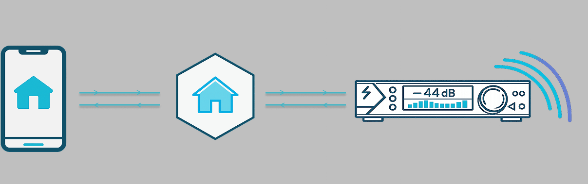
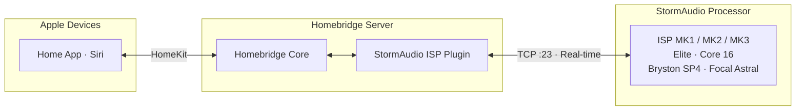

<h1 align="center">
<br>
homebridge-stormaudio-isp
</h1>

<p align="center">
<em>Bring your StormAudio theater into your smart home</em>
</p>

<p align="center">
<a href="https://github.com/dhrone/homebridge-stormaudio-isp/actions/workflows/ci.yml"></a>
<a href="https://codecov.io/gh/dhrone/homebridge-stormaudio-isp"></a>

<a href="https://www.npmjs.com/package/homebridge-stormaudio-isp"></a>
<a href="https://www.npmjs.com/package/homebridge-stormaudio-isp"></a>
<a href="https://github.com/dhrone/homebridge-stormaudio-isp/blob/main/LICENSE"></a>
<a href="https://github.com/homebridge/homebridge/wiki"></a>
<a href="https://nodejs.org"></a>
</p>

---

Your StormAudio ISP is one of the most capable processors on the market. This [Homebridge](https://homebridge.io) plugin makes it a first-class citizen in Apple HomeKit -- power, volume, inputs, presets, triggers, and multi-room audio, all controlled through the Home app and Siri.

_"Hey Siri, Movie Night."_ The processor wakes. Amplifiers power on. The screen descends. The volume drops to your preferred level, the input switches, and your movie preset loads -- room-corrected Atmos, exactly as you calibrated it. One phrase, no remote.

> [!TIP]
> **New to this plugin?** After installation, see the **[Usage Guide](USAGE.md)** for hands-on instructions covering Siri commands, scenes, automations, and practical tips.

## Table of Contents

- [Features](#features)
- [Architecture](#architecture)
- [Requirements](#requirements)
- [Installation](#installation)
- [Configuration](#configuration)
- [Troubleshooting](#troubleshooting)
- [Known Limitations](#known-limitations)
- [Acknowledgments](#acknowledgments)
- [Usage Guide](USAGE.md)

## Features

- **Power control** -- turn your theater on from the couch, the car, or anywhere in the house with automatic wake-from-sleep
- **Volume control** -- set volume to a specific level with Siri or a slider — configurable safety limits protect your speakers
- **Mute/unmute** -- mute and unmute by toggling the volume proxy on and off
- **Input switching** -- switch inputs by voice or from the Home app, with names imported directly from your processor
- **Zone 2 multi-room audio** -- control a second zone as a separate accessory with independent power, volume, mute, and source
- **Theater presets** -- switch your entire sound profile with a single command or automation
- **Hardware triggers** -- control amplifiers, projectors, and screens through HomeKit switches and automations
- **Bidirectional sync** -- HomeKit reflects processor changes in real time
- **Connection resilience** -- automatic reconnection with exponential backoff and indefinite long-poll recovery
- **Child Bridge compatible** -- recommended for isolation and stability

## Architecture

The plugin talks directly to your processor over your local network -- no cloud services, no internet dependency, no lag. A persistent TCP connection keeps everything in sync in real time without polling.



The plugin publishes these HomeKit accessories:

| Accessory       | Service Type                         | Controls                             | Purpose                                                                     |
| --------------- | ------------------------------------ | ------------------------------------ | --------------------------------------------------------------------------- |
| Main Zone       | Television + Fan/Lightbulb           | Power, volume, mute, input selection | Primary theater control — always created                                    |
| Zone 2          | Television (+ optional volume proxy) | Volume, mute, source selection       | Independent multi-room audio zone (if configured)                           |
| Presets         | Television                           | Preset selection                     | Switch sound profiles — room correction, surround mode (if configured)      |
| Triggers (1--4) | Switch or Contact Sensor             | On/off or state sensing              | Control amplifiers, projectors, screens via hardware relays (if configured) |

The connection is resilient — automatic reconnection with exponential backoff, indefinite long-poll recovery, and full state re-sync on reconnect. During disconnection, accessories show as **Off** in HomeKit.

## Requirements

- **Homebridge** 1.8.0 or later (including 2.0 beta). See the [Homebridge Wiki](https://github.com/homebridge/homebridge/wiki) for setup details.
- **Node.js** 20.0.0 or later
- **A supported processor** -- any processor with the StormAudio TCP/IP control API (port 23):
  - StormAudio ISP (all generations: MK1, MK2, MK3)
  - StormAudio ISP Elite
  - StormAudio ISP Core (16-channel)
  - Bryston SP4 (OEM StormAudio platform)
  - Focal Astral 16 (OEM StormAudio platform)
- **Network** -- the processor must be reachable from the Homebridge host via TCP on port 23. A static IP or DHCP reservation is strongly recommended.

## Installation

### Via Homebridge UI (recommended)

1. Open the Homebridge UI in your browser.
2. Go to the **Plugins** tab.
3. Search for `homebridge-stormaudio-isp`.
4. Click **Install**.

### Via command line

```sh
npm install -g homebridge-stormaudio-isp
```

### Child Bridge (recommended)

Running as a Child Bridge is recommended for stability -- it isolates the plugin in its own process. Enable it in the Homebridge UI under the plugin's **Bridge Settings**. See the [Usage Guide](USAGE.md#child-bridge-recommended-for-stability) for details.

## Configuration

### Via Homebridge UI (recommended)

After installing, click **Settings** on the StormAudio ISP plugin card. The settings form guides you through all available options.

### Via config.json

Add the platform to the `platforms` array in your Homebridge `config.json`:

```json
{
  "platforms": [
    {
      "platform": "StormAudioISP",
      "name": "Theater",
      "host": "192.168.1.100"
    }
  ]
}
```

### Configuration Reference

| Option            | Required | Default        | Description                                                                                         |
| ----------------- | -------- | -------------- | --------------------------------------------------------------------------------------------------- |
| `platform`        | Yes      | --             | Must be `"StormAudioISP"`                                                                           |
| `name`            | No       | `"StormAudio"` | Display name for the accessory in HomeKit                                                           |
| `host`            | **Yes**  | --             | IP address or hostname of your processor                                                            |
| `port`            | No       | `23`           | TCP port for the control API (1--65535)                                                             |
| `volumeCeiling`   | No       | `-20`          | Loudest volume in dB — maps to 100% in HomeKit. Range: -100 to 0.                                   |
| `volumeFloor`     | No       | `-100`         | Quietest volume in dB — maps to 0% in HomeKit. Range: -100 to 0. Must be less than `volumeCeiling`. |
| `volumeControl`   | No       | `"fan"`        | Volume proxy type: `"fan"`, `"lightbulb"`, or `"none"`                                              |
| `wakeTimeout`     | No       | `90`           | Seconds to wait for processor boot after power-on (30--300)                                         |
| `commandInterval` | No       | `100`          | Minimum ms between commands. Values below 85 may cause dropped commands.                            |
| `inputs`          | No       | `{}`           | Input name aliases (see [Input Aliases](#input-aliases))                                            |

#### Volume Range Mapping

Your processor uses decibel values (e.g., -80 dB to -20 dB), but HomeKit only understands 0--100%. The `volumeFloor` and `volumeCeiling` settings define the dB range that maps to that percentage scale — 0% equals your floor, 100% equals your ceiling. The processor never exceeds your ceiling, even at 100%. See the [Usage Guide](USAGE.md#volume) for a detailed mapping table.

> [!TIP]
> Your StormAudio processor has its own **Max Volume** setting configured by the installer in the web UI (Settings page). Set `volumeCeiling` to match or stay below that value — otherwise the top of your HomeKit slider will have no effect. Check your processor's Max Volume in the StormAudio web interface under Settings.

#### Volume Control Options

| Option        | Service Type           | Siri Volume | "Turn off all lights" safe?        |
| ------------- | ---------------------- | ----------- | ---------------------------------- |
| `"fan"`       | Fan (speed slider)     | Yes         | Yes                                |
| `"lightbulb"` | Lightbulb (brightness) | Yes         | **No** -- will mute your processor |
| `"none"`      | Disabled               | No          | N/A                                |

> [!WARNING]
> The lightbulb option works but has a hazard: saying "turn off all the lights" — or running any scene that turns off lights — mutes your processor. **Fan is the default and recommended option.**

#### Input Aliases

The plugin imports input names directly from your processor and updates them automatically. If you need to override names (e.g., for Siri compatibility), use the `inputs` field:

```json
{
  "inputs": {
    "3": "Apple TV",
    "5": "PS5"
  }
}
```

Keys are input ID numbers (visible in the Homebridge log on startup). Aliases override processor names for those inputs only.

#### Zone 2 Configuration

Zone 2 exposes a second audio zone as a separate Television accessory. See the [Usage Guide](USAGE.md#zone-2-multi-room-audio) for operational details.

| Option                | Default    | Description                                                                |
| --------------------- | ---------- | -------------------------------------------------------------------------- |
| `zone2.zoneId`        | --         | Zone ID from your processor (use the Config UI dropdown or enter manually) |
| `zone2.name`          | `"Zone 2"` | Display name (e.g., `"Patio"`)                                             |
| `zone2.volumeControl` | `"none"`   | Volume proxy: `"none"`, `"fan"`, or `"lightbulb"`                          |
| `zone2.volumeFloor`   | `-80`      | Minimum dB for volume mapping (0%)                                         |
| `zone2.volumeCeiling` | `-20`      | Maximum dB for volume mapping (100%)                                       |

Zone 2 uses mute/unmute to simulate power (the processor has no per-zone power). When in "Follow Main" mode, Zone 2 mirrors the main zone's input.

#### Presets Configuration

Presets expose theater configurations saved on the processor as a Television accessory.

| Option            | Default     | Description                                            |
| ----------------- | ----------- | ------------------------------------------------------ |
| `presets.enabled` | `false`     | Create a preset accessory in HomeKit                   |
| `presets.name`    | `"Presets"` | Display name (e.g., `"Theater Presets"`)               |
| `presets.aliases` | `{}`        | Override preset names (keys are preset IDs as strings) |

```json
"presets": {
  "enabled": true,
  "name": "Theater Presets",
  "aliases": {
    "9": "Movie Night",
    "12": "Music"
  }
}
```

#### Triggers Configuration

Triggers expose the processor's 4 hardware relay outputs as HomeKit accessories. Each trigger is independently configurable.

| Option            | Default       | Description                                                                           |
| ----------------- | ------------- | ------------------------------------------------------------------------------------- |
| `triggers.N.name` | `"Trigger N"` | Display name for trigger N (1--4)                                                     |
| `triggers.N.type` | `"none"`      | `"none"` (not exposed), `"switch"` (bidirectional), or `"contact"` (read-only sensor) |

```json
"triggers": {
  "1": { "name": "Amp Power", "type": "switch" },
  "2": { "name": "Screen Down", "type": "contact" },
  "3": { "name": "Projector", "type": "switch" }
}
```

- **Switch** -- appears as a toggle tile in the Home app; tap, use Siri, or include in scenes to control the relay. State changes from any source sync in real time.
- **Contact Sensor** -- read-only; reflects relay state but has no visible tile by default. Use as an automation trigger (e.g., "when Screen Down activates, dim the lights"). Choose this when the processor manages the relay and you only want HomeKit to react to changes.

See the [Usage Guide](USAGE.md#triggers) for a detailed comparison of switch vs. contact sensor behavior in HomeKit.

#### Complete Configuration Example

```json
{
  "platforms": [
    {
      "platform": "StormAudioISP",
      "name": "Theater",
      "host": "192.168.1.100",
      "port": 23,
      "volumeCeiling": -20,
      "volumeFloor": -80,
      "volumeControl": "fan",
      "wakeTimeout": 90,
      "commandInterval": 100,
      "inputs": {
        "3": "Apple TV",
        "5": "PS5",
        "7": "Roon"
      },
      "zone2": {
        "zoneId": 2,
        "name": "Patio",
        "volumeControl": "none",
        "volumeFloor": -80,
        "volumeCeiling": -20
      },
      "presets": {
        "enabled": true,
        "name": "Theater Presets",
        "aliases": {
          "9": "Movie Night",
          "12": "Music"
        }
      },
      "triggers": {
        "1": { "name": "Amp Power", "type": "switch" },
        "2": { "name": "Screen Down", "type": "contact" },
        "3": { "name": "Projector", "type": "switch" }
      }
    }
  ]
}
```

## Troubleshooting

For symptom-by-symptom solutions, log message reference, and debug capture instructions, see the [Usage Guide troubleshooting section](USAGE.md#troubleshooting-quick-reference).

To [open a GitHub issue](https://github.com/dhrone/homebridge-stormaudio-isp/issues), include your Homebridge and Node.js versions, plugin configuration (redact your IP if desired), and a [debug log](USAGE.md#capturing-a-debug-log).

## Known Limitations

- **Siri relative volume** -- "turn it up/down" commands are unreliable. Use absolute commands like "set Theater to 50%".
- **Single processor** -- one processor per platform instance. For multiple processors, add separate `StormAudioISP` entries.
- **Volume step granularity** -- HomeKit uses integer percentages. With wide volume ranges, some adjacent percentages may map to the same dB level.
- **Zone 2 "Follow Main"** -- when following the main zone, Zone 2 source cannot be changed independently.
- **Trigger auto-switching** -- trigger states that change during input or preset switches are reflected in HomeKit, but the switching logic is configured on the processor.
- **Detail view refresh** -- the Television tile detail view does not live-refresh on external changes. Navigate out and back in to see updates. This is a HomeKit platform behavior.
- **Contact sensors** -- not visible as tiles in the Home app; accessible only as automation conditions.
- **Surround mode** -- not yet exposed to HomeKit.
- **Dynamic range compression** -- night mode not yet exposed to HomeKit.
- **Dialog enhancement** -- not yet exposed to HomeKit.

## Acknowledgments

- [Homebridge](https://homebridge.io) -- for making HomeKit accessible to everyone
- [BMAD Method](https://github.com/bmad-code-org/BMAD-METHOD) -- the agent-based framework used to plan and manage this project
- [Claude](https://claude.ai) by [Anthropic](https://www.anthropic.com) -- AI assistant used throughout development via [Claude Code](https://claude.ai/claude-code)

## License

[Apache-2.0](LICENSE)
