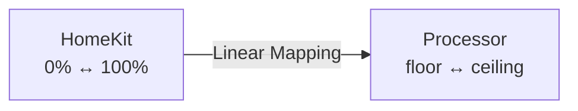
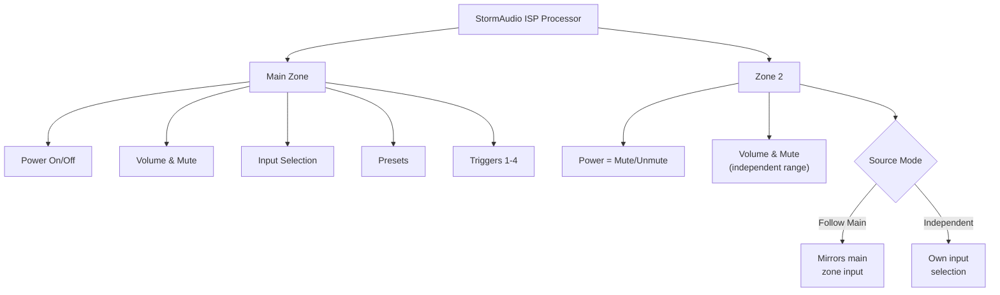

# Usage Guide

Your StormAudio processor is connected and ready. This guide walks you through everything you can do with it -- from voice commands and the Home app to scenes and automations that make your theater fit seamlessly into your daily routine. For installation, configuration, and architecture details, see the [README](README.md).

---

## Table of Contents

- [Quick Start](#quick-start)
- [Controlling Your Theater](#controlling-your-theater)
- [Zone 2 (Multi-Room Audio)](#zone-2-multi-room-audio)
- [Presets](#presets)
- [Triggers](#triggers)
- [Scenes and Automations](#scenes-and-automations)
- [Siri Voice Commands](#siri-voice-commands)
- [iOS Control Center Remote](#ios-control-center-remote)
- [Tips and Tricks](#tips-and-tricks)
- [Troubleshooting Quick Reference](#troubleshooting-quick-reference)

---

## Quick Start

The only required configuration is your processor's IP address — add the platform to your Homebridge `config.json` with `platform`, `name`, and `host` (see [Configuration](README.md#configuration)).

After starting Homebridge, the plugin connects to your processor, imports its input list, and publishes a Television accessory to HomeKit. Because the plugin runs on its own bridge process, you pair it separately:

1. In the Homebridge UI, go to the **Status** tab. The StormAudio Child Bridge appears with its own pairing QR code.
2. Open the **Home** app on your iPhone, tap **+**, then **Add Accessory**.
3. Scan the QR code, or tap **More Options** and enter the setup code manually.
4. HomeKit asks you to configure the accessory (room assignment, name, etc.).

You are set. Try saying _"Hey Siri, turn on the Theater"_ to confirm the connection -- you should see the processor wake up within a few seconds.

**What appears in the Home app:**

<!-- TODO: Add screenshot of Home app main zone tiles -->

_[Screenshot: Home app showing Television tile and volume fan tile -- coming soon]_

- A **Television tile** for power and input selection (named after your configured `name`)
- A **Fan tile** (default) or **Lightbulb tile** for volume control and mute
- An **input picker** inside the Television tile's detail view

> [!TIP]
> Inputs are imported automatically from your processor and update in real time when renamed. If names appear generic, rename them directly in your processor's configuration -- the plugin picks up changes automatically.

---

## Controlling Your Theater

All controls are bidirectional -- changes made on the processor (remote, front panel, web interface) are reflected in the Home app within about a second, and the plugin re-syncs automatically after any network interruption.

### Power

**Turn on:**

> "Hey Siri, turn on the Theater"

**Turn off:**

> "Hey Siri, turn off the Theater"

You can also tap the Television tile in the Home app.

**What happens when your processor is sleeping:** The plugin automatically wakes the processor. The Home app tile shows "on" immediately, but the processor takes time to fully boot and load its room calibration. Siri does not report an error -- it simply takes a moment.

**What "Not Responding" means:** If the plugin loses its network connection to the processor, the Home app tile shows the accessory as off or unresponsive. The plugin handles reconnection automatically -- you do not need to restart Homebridge. The plugin recovers even after extended outages.

---

### Volume

Control volume through a **fan** (default) or **lightbulb** proxy service that appears as a separate tile in the Home app.

**Set volume to a specific level:**

> "Hey Siri, set Theater to 50%"

Replace "Theater" with your accessory name.

#### How Percentage Maps to Decibels

The plugin maps 0--100% linearly between your configured `volumeFloor` and `volumeCeiling`:



**Example with floor = -80 dB and ceiling = -20 dB:**

| You say               | Volume set to                    |
| --------------------- | -------------------------------- |
| "Set Theater to 0%"   | -80 dB (floor -- silence)        |
| "Set Theater to 25%"  | -65 dB                           |
| "Set Theater to 50%"  | -50 dB                           |
| "Set Theater to 75%"  | -35 dB                           |
| "Set Theater to 100%" | -20 dB (ceiling -- never higher) |

Narrowing the range gives you finer control per percentage step. Pick a few levels you use regularly (30% for background, 50% for normal, 70% for movies) — they become second nature.

#### Volume Ceiling Safety

Even if someone asks Siri to "set Theater to 100%", the volume only reaches your configured ceiling (default: -20 dB). Your speakers and ears are protected, no matter who picks up the phone.

> [!TIP]
> **Align with your processor's Max Volume.** Your StormAudio installer may have configured a Max Volume limit in the processor's web UI (Settings page). Set `volumeCeiling` to match or stay below that value. If your ceiling exceeds the processor's Max Volume, the top portion of the HomeKit slider will have no audible effect because the processor clamps at its own limit. Note that other control surfaces (front panel, iOS remote, StormAudio web remote) are not constrained by this plugin's ceiling — they follow the processor's own Max Volume setting.

> [!WARNING]
> The lightbulb proxy mutes when "turn off all the lights" is triggered. Fan is recommended. See [Volume Control Options](README.md#volume-control-options).

#### Volume Buttons

The iOS Control Center remote's volume buttons send relative up/down commands (1 dB per press). These work even with `volumeControl` set to `"none"`.

> [!NOTE]
> **Why relative volume commands may not work:** Siri commands like "turn up the Theater" are unreliable. This is a HomeKit platform limitation. Use absolute commands ("set Theater to 50%") instead -- they always work.

---

### Mute

**Mute by turning off the volume proxy:**

> "Hey Siri, turn off the Theater"

When the fan (or lightbulb) is turned off, the processor mutes. Turning it on unmutes and restores the previous volume.

You can also tap the fan/lightbulb tile in the Home app to toggle.

> [!NOTE]
> "Hey Siri, mute the Theater" does not work reliably (same HomeKit limitation as relative volume). Use "turn off" and "turn on" instead.

When the processor is muted, the tile shows as off. When unmuted, it shows as on with the slider reflecting current volume. The Home app reflects changes from the processor remote or front panel within about a second.

---

### Input Switching

**From the Home app:**

<!-- TODO: Add screenshot of Home app input picker -->

_[Screenshot: Television tile detail view with input picker -- coming soon]_

1. Tap the Television tile to open its detail view
2. Tap the input selector
3. Choose the input you want

The processor switches immediately and the Home app confirms the selection.

**With Siri:**

> "Hey Siri, switch to TV on Theater"

Replace "TV" with the input name and "Theater" with your accessory name.

**Input names:** The best way to get Siri-friendly names is to rename inputs directly in your processor's configuration (via the web interface or remote app). The plugin reads names from the processor and updates HomeKit automatically.

If you cannot change names on the processor, override individual inputs using [input aliases](README.md#input-aliases) in the plugin configuration. Input IDs are visible in the Homebridge log on startup.

**Tips for input names:**

- Short, distinctive names work best with Siri: "TV", "PS5", "Roon" -- not "Living Room Television"
- Avoid names that overlap with other accessories
- You can rename inputs in the Home app, but those renames are cosmetic only and do not persist across re-pairings

**Input switching from sleep:** HomeKit does not allow input switching when the Television accessory is off. First turn it on, wait for it to boot, then switch inputs.

---

## Zone 2 (Multi-Room Audio)

If you have a second audio zone configured (e.g., patio speakers, outdoor zone), it appears as a separate Television accessory.



### Power

Zone 2 does not have independent power -- the main processor controls that. The Zone 2 accessory uses **mute/unmute to simulate power**:

- **"Turn on" Zone 2** = unmute (audio plays)
- **"Turn off" Zone 2** = mute (audio silenced)

> "Hey Siri, turn on the Patio"

> "Hey Siri, turn off the Patio"

Replace "Patio" with your Zone 2 accessory name.

### Volume

Zone 2 volume works like the main zone -- through a volume proxy (if configured) and the Control Center remote buttons.

> "Hey Siri, set Patio to 40%"

Zone 2 has its own volume floor and ceiling configured independently. As with the main zone, set these to match your amplifier's usable range.

### Mute

> "Hey Siri, turn off the Patio" _(mute)_

> "Hey Siri, turn on the Patio" _(unmute)_

### Source Selection

Zone 2 source selection depends on your processor configuration:

- **Follow Main** -- Zone 2 plays whatever the main zone is playing. Source cannot be changed independently.
- **Independent** -- if Zone 2 has its own audio inputs assigned in the StormAudio configuration, you can switch them using the Zone 2 input picker (same as the main zone).

To switch Zone 2 sources in independent mode, tap the Zone 2 Television tile and tap the input selector.

---

## Presets

Theater presets are saved configurations on the processor (audio processing, room correction, surround mode) that switch the entire sound profile with one action.

### Selecting a Preset

<!-- TODO: Add screenshot of preset accessory tile -->

_[Screenshot: Presets Television tile with preset list -- coming soon]_

The preset accessory appears as a Television tile. Its "inputs" are your available presets:

1. Tap the Presets tile to open its detail view
2. Tap the input selector
3. Choose the preset you want

The processor switches immediately. The preset list is imported automatically at connection time.

### Presets in Scenes and Automations

Presets work especially well in HomeKit Scenes:

> **Scene: "Movie Night"**
>
> - Presets accessory set to "Movie Night" preset
> - Theater fan set to 40% volume
> - Amp Power switch on

Then say:

> "Hey Siri, Movie Night"

### Preset Aliases

If processor preset names are not Siri-friendly, override them with [preset aliases](README.md#presets-configuration) in the plugin configuration. Preset IDs appear in the Homebridge log when presets are imported.

> [!NOTE]
> If you are inside the preset tile's detail view and the preset changes externally (from the processor remote, web UI, etc.), the selection does not update in real time. Navigate out and back in to see the update. This is a HomeKit platform behavior affecting all Television accessories.

---

## Triggers

Hardware triggers are relay outputs on the processor that control external equipment (amplifiers, projectors, screens, curtains). The plugin can expose them as switches or contact sensors.

### Switch Mode (Bidirectional Control)

Configure a trigger as a Switch to control it from HomeKit. It appears as a **toggle tile** in the Home app -- tap to turn on or off, just like a smart plug or light switch. State changes from any source (auto-switching on wake/preset, manual override, front panel) sync to HomeKit in real time, so the tile always reflects the actual relay state.

Switches are fully controllable:

- **Tap the tile** in the Home app to toggle on/off
- **Voice control:** "Hey Siri, turn on Amp Power"
- **Scenes:** include in a scene alongside other accessories (e.g., "Movie Night" turns on amp, projector, and processor together)
- **Automations:** use as both a trigger ("when Amp Power turns on...") and an action ("...then turn on Projector")

### Contact Sensor Mode (Read-Only)

A trigger configured as a Contact Sensor is **read-only** -- it cannot be controlled from HomeKit. The sensor reflects the relay state: when the trigger activates, the sensor reports "contact detected"; when it deactivates, "no contact". This makes it useful as an automation input when you want HomeKit to react to processor-driven trigger changes without giving HomeKit the ability to control the relay directly.

> [!NOTE]
> Contact sensors **do not appear as visible tiles** in the Home app by default. You won't see them on your room's main screen. They are accessible when creating automations (as a condition or trigger) and in the accessory detail list under the room settings. If you want a visible, tappable tile, use Switch mode instead.

**Example automation:** When "Screen Down" sensor detects contact, dim the lights to 20%.

Contact sensors retain their last known state during brief network disconnections.

#### Which Mode Should I Choose?

|                                  | Switch                                           | Contact Sensor                                                                               |
| -------------------------------- | ------------------------------------------------ | -------------------------------------------------------------------------------------------- |
| Visible tile in Home app         | Yes -- toggle on/off                             | No -- hidden by default                                                                      |
| Controllable from HomeKit        | Yes -- tap, Siri, scenes                         | No -- read-only                                                                              |
| Usable as automation trigger     | Yes                                              | Yes                                                                                          |
| Reflects processor state changes | Yes                                              | Yes                                                                                          |
| Best for                         | Equipment you want to control (amps, projectors) | Equipment managed by the processor that you want to react to (screen relays, status signals) |

---

## Scenes and Automations

This is where individual controls become orchestrated experiences. A single voice command or scheduled trigger sets your entire theater exactly the way you want it -- power, volume, input, preset, and equipment all at once. For general instructions on creating scenes and automations, see Apple's guide: [Create scenes and automations with the Home app](https://support.apple.com/en-us/102313).

### Example: "Movie Night" Scene

Create a Scene that:

- Turns on the Television accessory (powers on the processor)
- Sets the fan proxy to 40% (volume)
- Sets the input to Apple TV
- Sets the Presets accessory to "Movie Night"
- Turns on the Amp Power switch
- Turns on the Projector switch

Then say:

> "Hey Siri, Movie Night"

Everything happens at once. If the processor is sleeping, it wakes automatically. No remotes to juggle, no apps to open, no walking to the rack.

### Example: "Goodnight" Automation

Create a time-based Automation that runs at 11:00 PM:

- Turns off the Television accessory (processor off)
- Turns off the Amp Power switch
- Turns off Zone 2 (mutes patio)

Or use presence-based:

- When the last person leaves, turn off the Television accessory

No more lying in bed wondering if you left the theater on.

### Example: Screen Automation

If your screen trigger is a Contact Sensor:

> When "Screen Down" sensor detects contact, dim the lights to 20% and set temperature to movie mode

### What Can Be Included

| Action                  | How to set it                                     |
| ----------------------- | ------------------------------------------------- |
| Power on/off            | Television accessory on/off                       |
| Volume level            | Fan or lightbulb proxy percentage                 |
| Mute/unmute             | Fan or lightbulb proxy on/off                     |
| Input selection         | Television accessory active input                 |
| Zone 2 on/off           | Zone 2 Television on/off (mute/unmute)            |
| Zone 2 volume           | Zone 2 fan or lightbulb proxy                     |
| Zone 2 source           | Zone 2 Television active input (independent mode) |
| Preset selection        | Presets Television active input                   |
| Trigger on/off          | Trigger Switch on/off                             |
| Automation from trigger | Trigger Contact Sensor state                      |

### What Cannot Be Automated

- **Surround mode switching** -- not yet exposed to HomeKit
- **Dynamic range compression (night mode)** -- not yet exposed

---

## Siri Voice Commands

### Commands That Work

| Command                                     | Action                                                |
| ------------------------------------------- | ----------------------------------------------------- |
| "Set **Theater** to 50%"                    | Sets volume to 50% of your configured range           |
| "Turn off **Theater**"                      | Powers off the processor (or mutes the volume proxy)  |
| "Turn on **Theater**"                       | Powers on the processor (or unmutes the volume proxy) |
| "Hey Siri, switch to **TV** on **Theater**" | Switches to the named input                           |
| "Hey Siri, **Movie Night**"                 | Activates a scene by name                             |

Replace **Theater** with your configured `name`.

### Commands That Do Not Work (Apple Limitations)

| Command                         | Why                                      |
| ------------------------------- | ---------------------------------------- |
| "Set **Theater** volume to 50%" | Siri does not support TV volume commands |
| "Mute **Theater**"              | No HomeKit mute voice command exists     |
| "Turn up/down **Theater**"      | Relative volume routing is unreliable    |

> [!TIP]
> **Workaround for input switching:** Create a HomeKit Scene that sets the desired input, then activate it by name: "Hey Siri, Movie Night."

---

## iOS Control Center Remote

Your processor appears in the iOS Control Center remote widget automatically.

<!-- TODO: Add screenshot of iOS Control Center remote -->

_[Screenshot: iOS Control Center remote connected to StormAudio -- coming soon]_

### Setup

1. Open **Control Center** (swipe down from the top-right corner)
2. Tap the **Remote** widget (remote control icon)
3. The first time, tap **"Choose a TV"** at the top and select your processor
4. You may need to reselect your processor each time you open the remote

### Controls

- **Volume buttons** (physical side buttons) -- send volume up/down to the processor
- **Mute button** (speaker icon) -- toggles mute

The remote provides relative volume control only. For absolute volume, use Siri or the fan/lightbulb slider.

---

## Tips and Tricks

### Naming for Siri

Choosing good accessory names makes Siri more reliable:

- **"Theater"** works well -- short, unique, and unlikely to conflict with other accessories or apps
- **Avoid app name conflicts** -- if the StormAudio iOS app is installed, Siri may try to open the app instead of controlling HomeKit. Use a unique name like "Theater" or "Processor".
- **Avoid reserved words** -- "volume", "brightness", "speaker", and "temperature" in the name can confuse Siri's intent parsing
- **Keep it short** -- one or two words works best for Siri recognition
- **Use rooms** -- assign the accessory to a room in HomeKit. Siri uses room context for disambiguation, so you do not need the room name in the accessory name
- **The volume proxy uses the same name** -- when you say "set Theater to 50%", Siri targets the fan/lightbulb proxy. This is by design.

### Dedicated HomeKit Room

As you add Zone 2, presets, and triggers, your Home app fills up fast. A dedicated room keeps everything organized:

1. Open the **Home** app, tap **+** then **Add Room**
2. Name it "Theater Controls" or "StormAudio"
3. Move all plugin accessories into it

Room assignment also helps Siri find the right accessory.

### Child Bridge: Recommended for Stability

The plugin runs on its own Child Bridge by default. This means:

- Plugin issues do not affect other Homebridge accessories
- The plugin restarts independently
- Plugin status is visible separately in the Homebridge UI

To enable a Child Bridge explicitly via `config.json`:

```json
{
  "platforms": [
    {
      "platform": "StormAudioISP",
      "name": "Theater",
      "host": "192.168.1.100",
      "_bridge": {
        "username": "CC:22:3D:E3:CE:31",
        "port": 51827
      }
    }
  ]
}
```

The `username` must be a unique MAC-style address not used by other bridges. The `port` must be a unique port number.

### Multiple Rooms

After pairing, assign the accessory to any room in the Home app (long-press tile, tap gear icon, change room). This helps with Siri disambiguation.

### StormAudio Remote App

Your StormAudio processor also has a web-based remote interface accessible from any browser on your network:


_The StormAudio web remote provides direct access to all processor controls. HomeKit reflects changes made here in real time._

---

## Troubleshooting Quick Reference

Something not working as expected? Most issues have straightforward fixes.

| Symptom                                  | Likely Cause                    | Fix                                                                                                 |
| ---------------------------------------- | ------------------------------- | --------------------------------------------------------------------------------------------------- |
| Accessory shows "Not Responding"         | Network connection lost         | Check that the processor is powered on and reachable. The plugin retries automatically.             |
| Inputs not showing                       | Accessory needs re-pairing      | Remove the accessory from Home app and re-pair. Check log for `[HomeKit] Input sources registered`. |
| Siri says "I can't do that" for volume   | Using relative command          | Use "set Theater to 50%" instead of "turn it up".                                                   |
| Volume changes not audible               | Volume range too low or narrow  | Raise `volumeFloor` (e.g., -80) for a more usable range.                                            |
| "Mute the Theater" does not work         | Siri limitation                 | Use "turn off Theater" to mute, "turn on Theater" to unmute.                                        |
| Processor slow to respond after power-on | Normal boot time                | Expected behavior while loading room calibration. Increase `wakeTimeout` if needed.                 |
| Siri opens the StormAudio app            | Name conflicts with iOS app     | Rename accessory to "Theater" or "Processor".                                                       |
| Wrong state after network outage         | State not re-synced yet         | Wait a few seconds -- the plugin re-syncs automatically on reconnection.                            |
| Plugin stops after startup failure       | Processor unreachable at launch | The plugin retries every 20s indefinitely. No restart needed.                                       |
| Zone 2 not appearing                     | `zone2.zoneId` missing or wrong | Use Config UI dropdown to select the correct zone ID.                                               |
| Zone 2 source cannot be changed          | Zone 2 in "Follow Main" mode    | Assign independent audio inputs in the StormAudio configuration.                                    |
| Presets not appearing                    | `presets.enabled` is false      | Set `presets.enabled: true` and restart Homebridge.                                                 |
| Preset list is empty                     | No saved presets on processor   | Create presets in StormAudio configuration, then restart Homebridge.                                |
| Triggers not appearing                   | No triggers configured          | Add triggers with `"type": "switch"` or `"type": "contact"`.                                        |

### Understanding Log Messages

The plugin uses structured log prefixes to help you identify issues:

| Prefix      | Category        | What to look for                                 |
| ----------- | --------------- | ------------------------------------------------ |
| `[Config]`  | Configuration   | Validation errors on startup                     |
| `[TCP]`     | Connection      | Connect/disconnect events, reconnection attempts |
| `[Command]` | Protocol        | Commands sent and received (debug level)         |
| `[State]`   | Processor state | Power transitions, wake timeouts, input imports  |
| `[HomeKit]` | Accessory       | Service registration, characteristic updates     |

To see debug-level messages, start Homebridge with the `-D` flag or enable debug mode in the Homebridge UI.

### Capturing a Debug Log

```sh
homebridge -CD 2>&1 | tee homebridge-debug.log
```

To extract only this plugin's messages:

```sh
grep "Theater" homebridge-debug.log > stormaudio-debug.log
```

Replace `Theater` with your configured accessory name.

### Getting Help

If troubleshooting does not resolve your issue, [open a GitHub issue](https://github.com/dhrone/homebridge-stormaudio-isp/issues) with:

- Your Homebridge and Node.js versions
- Your plugin configuration (redact your IP address if desired)
- The relevant portion of your debug log

---

For full configuration options and technical details, see the [README](README.md).
