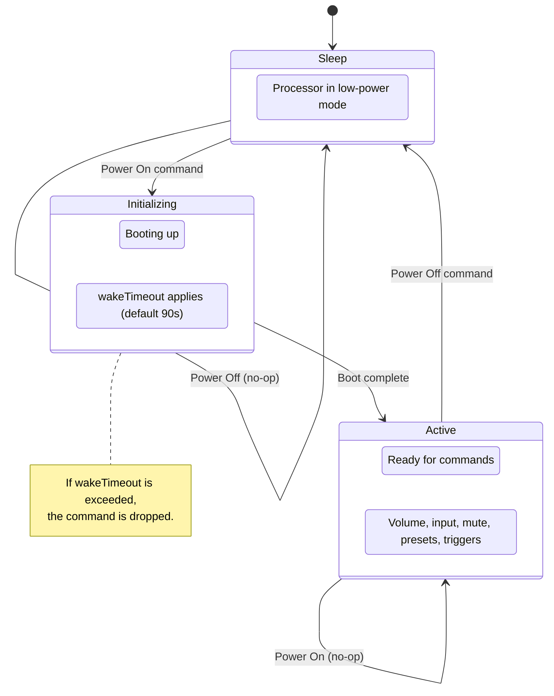
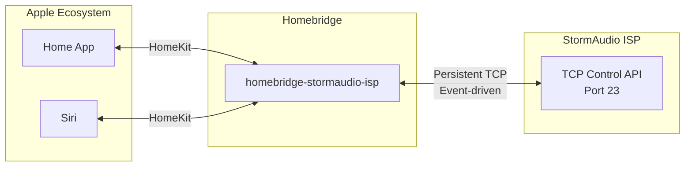

# Mermaid Diagram Examples

## Power State Machine

```mermaid
stateDiagram-v2
    [*] --> Sleep

    Sleep --> Initializing : Power On command
    Initializing --> Active : Boot complete
    Active --> Sleep : Power Off command

    Sleep --> Sleep : Power Off (no-op)
    Active --> Active : Power On (no-op)

    state Sleep {
        direction LR
        s1 : Processor in low-power mode
    }

    state Initializing {
        direction LR
        s2 : Booting up
        s3 : wakeTimeout applies (default 90s)
    }

    state Active {
        direction LR
        s4 : Ready for commands
        s5 : Volume, input, mute, presets, triggers
    }

    note right of Initializing
        If wakeTimeout is exceeded,
        the command is dropped.
    end note
```

## Simple Architecture Flow

```mermaid
graph LR
    subgraph Apple["Apple Ecosystem"]
        HomeApp["Home App"]
        Siri["Siri"]
    end

    subgraph HB["Homebridge"]
        Plugin["homebridge-stormaudio-isp"]
    end

    subgraph Processor["StormAudio ISP"]
        API["TCP Control API\nPort 23"]
    end

    HomeApp <-->|"HomeKit"| Plugin
    Siri <-->|"HomeKit"| Plugin
    Plugin <-->|"Persistent TCP\nEvent-driven"| API
```
